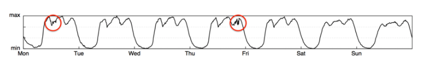

### 题目
**基于机器学习方法CDN网络中KPI异常检测**

----

### 简要背景介绍
* 互联网时代，多媒体点播网站，这些网站的流量是通过内容分发网络(CDN)分发给用户。内容分发网络是建立并覆盖在承载网之上，由分布在不同区域的边缘节点服务器群组成的分布式网络，CDN网络应用广泛，支持多种行业，多种场景内容加速，例如：图片小文件、大文件下载、视音频点播、直播流媒体、全栈加速、安全加速。综上，解决与CDN管理相关的问题对其实际应用至关重要。CDN运营商通常会收集每个网站的各种KPI，如流量、延迟、命中率等，并对这些多变量KPI进行异常检测，以支持CDN运营商做出正确的网络维护决策。目前KPI异常检测指的是通过算法分析KPI的时间序列数据，判断其是否出现异常行为。

* 多变量时间序列异常检测是数据挖掘领域中一个相当活跃的话题，广泛应用于各行各业，如有医疗保健、航空航天、工业生产和互联网ISP领域中。目前基于深度学习的多变量时间序列异常检测算法存在明显缺陷[[30]](#refer-anchor-30)。

* 时间序列分类（Time Series Classification, TSC）在近年来一直都有被广泛研究[[31]](#refer-anchor-31)，一系列的TSC算法都被证明有很好的效果，但它们中主要的关注点都在单变量TSC（Univariate time series classification）。但是在现实生活中更常见的是多变量TSC分类问题（Multivariate time series classification, MTSC），即每个时间序列拥有多个维度，例如心电图（ECG），脑电图（EEG），系统监测等等。对于多变量时间序列分类问题，一种简单的方法是将单变量分类器集成到多变量维度上来做分类。

----

### 关键词

+ CDN异常检测
+ 多变量时间序列异常检测
+ MTS 多变量时间序列
+ 关键性能指标
+ KPI异常检测
+ （具体方法名称）

----

### 具体场景
* 现如今随着互联网公司业务及服务规模的不断增长，传统网络运维管理手段在复杂实际场景下KPI异常检测任务中面临诸多挑战与困难。基于机器学习的CDN 网络KPI异常检测技术，作为一种网络故障早期预警及风险评估的重要手段，是当前网络风险控制的必然发展方向以及重要决策基础。这些KPI大致分为两种类型：服务KPI和机器KPI，运维人员通过监控各种各样的关键性能指标(KPI)来判断网络服务是否稳定。如下图中展示了一个KPI异常的例子——某互联网公司的网页访问量数据发生了异常，其中红色圆圈标示了KPI发生的异常。[[45]](#refer-anchor-45)[[46]](#refer-anchor-46)

KPI异常的例子

----

### 基本要求
* 学生可在下列三个方向中选择或是结合下列三个方向
    + **方向一**：目前一些常见的KPI异常检测方法通过机器学习来实现[[40]](#refer-anchor-40)，它们主要考虑异常或异常值的行为与正常数据不同，基于此引入了一些无监督学习方法[[1]](#refer-anchor-1)[[2]](#refer-anchor-2)[[3]](#refer-anchor-3)[[4]](#refer-anchor-4)[[12]](#refer-anchor-12)[[13]](#refer-anchor-13)[[14]](#refer-anchor-14)[[15]](#refer-anchor-15)[[18]](#refer-anchor-18)[[19]](#refer-anchor-19)[[20]](#refer-anchor-20)[[21]](#refer-anchor-21)[[22]](#refer-anchor-22)[[23]](#refer-anchor-23)[[24]](#refer-anchor-24)[[39]](#refer-anchor-39)。其中包括基于距离的方法、基于聚类的方法[[34]](#refer-anchor-34)、基于相似性的方法和基于分类的方法，这些方法存在局限性，因其未能考虑时间序列的时间依赖性[[27]](#refer-anchor-27)。抛开有监督和无监督的机器学习方法，基于分布迁移下的深度学习方法也是一种及其有效的异常检测方法[[37]](#refer-anchor-37)[[38]](#refer-anchor-38)，但目前的成熟的研究方法有限。学生须较为深入了解和总结前人的深度学习方法[[17]](#refer-anchor-17)[[25]](#refer-anchor-25)，在前人的基础上有所改进，进而复现一种深度学习模型，或提出一种加以改进的深度学习模型（如设计一种时间递归神经网络LSTM模型改进RNN模型的缺陷），对CDN KPI的时间序列数据进行表征和预处理[[26]](#refer-anchor-26)，提取特征和构建模型。并尝试解决下列问题：
        - 1）如何提高模型异常检测结果的准确性，如不同网站之间KPI的动态复杂性（两个不同类型的网站，会因为一些相似的特征，干扰模型的判断）。

        - 2）某个网站的CDN序列可能在不同时间表现不一样，对于模型而言，可能会识别为异常状态，尝试通过深度学习方法解决这一问题。
    
    + **方向二**：深度学习方法可能存在一定的局限性，往往需要结合其他方法，如引入变分循环结构[[5]](#refer-anchor-5)，概率混合模型[[6]](#refer-anchor-6)[[7]](#refer-anchor-7)，分层时间记忆模型[[8]](#refer-anchor-8)[[9]](#refer-anchor-9)[[28]](#refer-anchor-28)等等[[10]](#refer-anchor-10)[[11]](#refer-anchor-11)，或结合各种方法的特点综合采用，或对方法某一个方面进行改进，对相对复杂的KPI多变量时间序列进行建模并捕捉其中的不同的结构和动态特征[[41]](#refer-anchor-41)，通过这些特征结合相应的方法训练出相应的模型。此外研究异常产生的原因，提高自身异常检测模型的可解释性[[29]](#refer-anchor-29)。

    + **方向三**：在CDN网络KPI异常检测中采用时间序列分解算法，选择一些经典的时间序列分解算法，得到残差，并结合一些异常判断准则求取残差上下界[[32]](#refer-anchor-32)。

* 测试应用模型的平衡F分数，或通过其他方法估计模型的准确率[[16]](#refer-anchor-16)。

* 可以引入多种代表性方法，比较不同方法之间好坏[[33]](#refer-anchor-33)，指出方法关键点，有模型相应的数学公式推导[[30]](#refer-anchor-30)。

* 建议：深度学习方法和异常检测滤波器结合。例如，基于深度卷积网络和用于鲁棒异常的贝叶斯过滤，二者结合完成多元时间序列异常检测[[27]](#refer-anchor-27)。

----

### 其他

* 数据集合来源[[29]](#refer-anchor-29)：在该文中介绍了用于异常检测的开放访问时间序列数据集。
* CDN-X-ALL网络指标数据集[[35]](#refer-anchor-35)
* SDFVAE[[3]](#refer-anchor-3)中训练所用的数据集[[36]](#refer-anchor-36)
* 微软提供的一个KPI异常检测数据集[[42]](#refer-anchor-42)
* 第一届AIops异常检测项目的数据集[[43]](#refer-anchor-43)[[44]](#refer-anchor-44)
* CCF国际AIOps挑战赛数据集[[48]](#refer-anchor-48)
* KPI异常检测其他数据集和资料汇总[[49]](#refer-anchor-49)
* 多变量时间序列异常检测数据集整理[[50]](#refer-anchor-50)
----

## 参考文献：

- [1] Zhang, Chuxu, et al. "A deep neural network for unsupervised anomaly detection and diagnosis in multivariate time series data." Proceedings of the AAAI conference on artificial intelligence. Vol. 33. No. 01. 2019.

- [2] Su, Ya, et al. "Robust anomaly detection for multivariate time series through stochastic recurrent neural network." Proceedings of the 25th ACM SIGKDD international conference on knowledge discovery & data mining. 2019.

- [3] Dai, Liang, et al. "SDFVAE: Static and dynamic factorized vae for anomaly detection of multivariate cdn kpis." Proceedings of the Web Conference 2021. 2021.

- [4] Zong, Bo, et al. "Deep autoencoding gaussian mixture model for unsupervised anomaly detection." International conference on learning representations. 2018.

- [5] Dai, Liang, et al. "Switching Gaussian Mixture Variational RNN for Anomaly Detection of Diverse CDN Websites." IEEE INFOCOM 2022-IEEE Conference on Computer Communications. IEEE, 2022.

- [6] Hodge, Victoria, and Jim Austin. "A survey of outlier detection methodologies." Artificial intelligence review 22.2 (2004): 85-126.

- [7] Yang, Li, et al. "Multi-Perspective Content Delivery Networks Security Framework Using Optimized Unsupervised Anomaly Detection." IEEE Transactions on Network and Service Management 19.1 (2021): 686-705.

- [8] Zhao, Ning, et al. "HTMTAD: A Model to Detect Anomalies of CDN Traffic Based on Improved HTM Network." International Conference on Neural Information Processing. Springer, Cham, 2018.

- [9]赵宁. 基于时间序列分析的CDN流量异常检测技术研究[D].南京理工大学,2019.DOI:10.27241/d.cnki.gnjgu.2019.000183.

- [10] Zhang, Shenglin, et al. "Efficient KPI Anomaly Detection Through Transfer Learning for Large-Scale Web Services." IEEE Journal on Selected Areas in Communications (2022).

- [11] Redzik, Radosław Marek. Anomaly detection in Content Delivery Networks. Diss. Instytut Telekomunikacji, 2016.

- [12] Li, Jinbo, Witold Pedrycz, and Iqbal Jamal. "Multivariate time series anomaly detection: A framework of Hidden Markov Models." Applied Soft Computing 60 (2017): 229-240.

- [13] Zhang, Chuxu, et al. "A deep neural network for unsupervised anomaly detection and diagnosis in multivariate time series data." Proceedings of the AAAI conference on artificial intelligence. Vol. 33. No. 01. 2019.

- [14] Audibert, Julien, et al. "Usad: Unsupervised anomaly detection on multivariate time series." Proceedings of the 26th ACM SIGKDD International Conference on Knowledge Discovery & Data Mining. 2020.

- [15] Deng, Ailin, and Bryan Hooi. "Graph neural network-based anomaly detection in multivariate time series." Proceedings of the AAAI Conference on Artificial Intelligence. Vol. 35. No. 5. 2021.

- [16] Garg, Astha, et al. "An evaluation of anomaly detection and diagnosis in multivariate time series." IEEE Transactions on Neural Networks and Learning Systems 33.6 (2021): 2508-2517.

- [17] Li, Dan, et al. "Anomaly detection with generative adversarial networks for multivariate time series." arXiv preprint arXiv:1809.04758 (2018).

- [18] Li, Jinbo, et al. "Clustering-based anomaly detection in multivariate time series data." Applied Soft Computing 100 (2021): 106919.

- [19] Munir, Mohsin, et al. "DeepAnT: A deep learning approach for unsupervised anomaly detection in time series." Ieee Access 7 (2018): 1991-2005.

- [20] Pereira, Joao, and Margarida Silveira. "Unsupervised anomaly detection in energy time series data using variational recurrent autoencoders with attention." 2018 17th IEEE international conference on machine learning and applications (ICMLA). IEEE, 2018.

- [21] Landauer, Max, et al. "Time series analysis: unsupervised anomaly detection beyond outlier detection." International Conference on Information Security Practice and Experience. Springer, Cham, 2018.

- [22] Li, Jia, et al. "FluxEV: a fast and effective unsupervised framework for time-series anomaly detection." Proceedings of the 14th ACM International Conference on Web Search and Data Mining. 2021.

- [23] Pereira, Joao, and Margarida Silveira. "Unsupervised anomaly detection in energy time series data using variational recurrent autoencoders with attention." 2018 17th IEEE international conference on machine learning and applications (ICMLA). IEEE, 2018.

- [24] Ahmad, Subutai, et al. "Unsupervised real-time anomaly detection for streaming data." Neurocomputing 262 (2017): 134-147.

- [25] Park, Jinuk, Yongju Park, and Chang-Il Kim. "TCAE: Temporal Convolutional Autoencoders for Time Series Anomaly Detection." 2022 Thirteenth International Conference on Ubiquitous and Future Networks (ICUFN). IEEE, 2022.

- [26] Pranavan, Theivendiram, et al. "Contrastive predictive coding for Anomaly Detection in Multi-variate Time Series Data." arXiv preprint arXiv:2202.03639 (2022).

- [27] Guan, Siwei, et al. "GTAD: Graph and Temporal Neural Network for Multivariate Time Series Anomaly Detection." Entropy 24.6 (2022): 759.

- [28] He, Qiang, et al. "MTAD-TF: Multivariate time series anomaly detection using the combination of temporal pattern and feature pattern." Complexity 2020 (2020).

- [29] Li, Gen, and Jason J. Jung. "Deep learning for anomaly detection in multivariate time series: Approaches, applications, and challenges." Information Fusion (2022).

- [30] Wu, Hu-Sheng. "A survey of research on anomaly detection for time series." 2016 13th International Computer Conference on Wavelet Active Media Technology and Information Processing (ICCWAMTIP). IEEE, 2016.

- [31] Ruiz, Alejandro Pasos, et al. "The great multivariate time series classification bake off: a review and experimental evaluation of recent algorithmic advances." Data Mining and Knowledge Discovery 35.2 (2021): 401-449.

- [32] [网络KPI异常检测之时序分解算法](https://www.cnblogs.com/huaweiyun/p/13093365.html)

- [33] 陈德.多变量时间序列数据的异常检测方法研究.2020.武汉理工大学,MA thesis.

- [34] 丁望祥.多变量时间序列数据聚类和异常检测算法研究.2020.南京大学,MA thesis.

- [35] [Fed4Fire/CDN-X-ALL network metrics dataset for time series analysis in Media content delivery for 4G/5G networks](https://zenodo.org/record/3459164#.Y3ZWEHZBxD8)

- [36] [dlagul/SDFVAE](https://github.com/dlagul/SDFVAE/tree/main/data_preprocess/data)

- [37] Zhang, Shenglin, et al. "Efficient KPI Anomaly Detection Through Transfer Learning for Large-Scale Web Services." IEEE Journal on Selected Areas in Communications (2022).

- [38] 钱骥.基于机器学习的KPI异常检测技术研究.2020.国防科技大学,MA thesis.

- [39] 张圣林, et al."基于深度学习的无监督KPI异常检测." 数据与计算发展前沿 2.03(2020):87-100.

- [40] 孙永谦, et al."KPI异常检测方法评估." 数据与计算发展前沿 4.03(2022):46-65.

- [41] [5.4.1.1 核心网KPI异常检测数据集及特征介绍](https://www.bilibili.com/video/BV14Y4y1z7Zm/?spm_id_from=333.337.search-card.all.click&vd_source=9c46ec3fc5b4dbcb89ae602025bd6838)

- [42] [KPI异常检测（一）——Time-Series Anomaly Detection Service at Microsoft](https://zhuanlan.zhihu.com/p/464943285)

- [43] [AIops Anomaly Detection Dataset](https://download.csdn.net/download/qj8380078/10475044?spm=1001.2101.3001.6650.1&utm_medium=distribute.pc_relevant.none-task-download-2%7Edefault%7ECTRLIST%7EPaid-1-10475044-blog-118072380.pc_relevant_recovery_v2&depth_1-utm_source=distribute.pc_relevant.none-task-download-2%7Edefault%7ECTRLIST%7EPaid-1-10475044-blog-118072380.pc_relevant_recovery_v2&utm_relevant_index=2)

- [44] [异常检测常用的一些数据集](https://download.csdn.net/download/weixin_39940512/14008876?spm=1001.2101.3001.6661.1&utm_medium=distribute.pc_relevant_t0.none-task-download-2%7Edefault%7ECTRLIST%7EPaid-1-14008876-blog-118072380.pc_relevant_recovery_v2&depth_1-utm_source=distribute.pc_relevant_t0.none-task-download-2%7Edefault%7ECTRLIST%7EPaid-1-14008876-blog-118072380.pc_relevant_recovery_v2&utm_relevant_index=1)

- [45] [KPI异常检测竞赛笔记](https://zhuanlan.zhihu.com/p/41201506)

- [46] [网络AI算法之KPI异常检测算法](https://www.bilibili.com/video/av795781853/?vd_source=9c46ec3fc5b4dbcb89ae602025bd6838)

- [47] [微软亚研院的AIOps底层算法： KPI快速聚类](http://www.yunweipai.com/23505.html)

- [48] [AIOps Challenge 国际智能运维挑战赛](https://aiops-challenge.com/)

- [49] [《异常检测——从经典算法到深度学习》9 异常检测资料汇总（持续更新&抛砖引玉）](https://blog.csdn.net/smileyan9/article/details/113728611)

- [50] [【时间序列】多变量时间序列异常检测数据集整理及标准化处理代码合集](https://blog.csdn.net/qq_33431368/article/details/125925577)