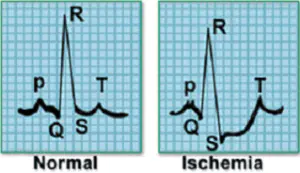

### 题目
**基于深度学习方法的心电图疾病识别**

----

### 简要背景介绍

* 时间序列分类（Time Series Classification, TSC）在近年来一直都有被广泛研究[[1]](#refer-anchor-1)，一系列的TSC算法都被证明有很好的效果，但它们中主要的关注点都在单变量TSC（Univariate time series classification）。但是在现实生活中更常见的是多变量TSC分类问题（Multivariate time series classification, MTSC），即每个时间序列拥有多个维度，例如心电图（ECG），脑电图（EEG），系统监测等等。在时序数据挖掘的研究与应用领域，时序数据分类是重要任务之一[[2]](#refer-anchor-2)[[3]](#refer-anchor-3)[[4]](#refer-anchor-4)。例如，依据心电图的时序波形识别出病者所患的病症，依据地震波的历史数据，去识别地震的类型。对于多变量时间序列分类问题，一种简单的方法是将单变量分类器集成到多变量维度上来做分类。

* 心电图（ECG, Electrocardiogram）是人体心脏活动的视觉时间序列，是医生诊断心脏病的重要依据。基于传统心电图分类的诊疗技术基本依靠人力完成。专家以自己多年积累的经验和大量心脏领域的知识，得到准确的诊断结果。然而在心脏疾病高发的当今，每天都有大量的患者去做心电图，只依靠人力去诊断，效率十分低下，而且也可能出现误诊断，会对患者和医院造成不好的影响。为了解决上述问题，心电图分类诊断技术开始出现。

----

### 关键词

+ 心电图分类/ECG分类
+ 多变量时间序列分类
+ MTS 多变量时间序列
+ 特征提取
+ （具体方法名称）

----

### 具体场景
* 通过相关硬件采集原始心电图信号数据，对数据进行处理后，通过构建的分类模型进行诊断[[27]](#refer-anchor-27)。
* 例如，考虑如下信号样本，其代表一个心跳的电活动。左侧图像表示正常心跳，而相邻的图像表示心肌梗塞。

KPI异常的例子

* 从电极捕获的数据将是时间序列的形式，并且信号可以分类为不同的类别。

----

### 基本要求
* 一般有两种主要的心电图分类研究形式，基于波形形状的分类方法和基于波形特征的分类方法[[12]](#refer-anchor-12)，要求从二者中对心电图进行分析处理。

* 对获取的心电图数据进行预处理[[7]](#refer-anchor-7)[[10]](#refer-anchor-10)[[11]](#refer-anchor-11)，并对预处理后的数据进行特征工程处理[[24]](#refer-anchor-24)[[25]](#refer-anchor-25)，传统方法人为提取特征，会导致系统不稳定，可以利用网络的深层次学习能力自动学习信号的特征[[13]](#refer-anchor-13)，模型可以采用RNN[[17]](#refer-anchor-17)[[18]](#refer-anchor-18)[[19]](#refer-anchor-19)[[20]](#refer-anchor-20)[[21]](#refer-anchor-21)或是LSTM等深度学习方法[[22]](#refer-anchor-22)从多变量时间中学习序列数据[[5]](#refer-anchor-5)[[8]](#refer-anchor-8)[[14]](#refer-anchor-14)[[16]](#refer-anchor-16)，亦或是LSTM结合AE[[15]](#refer-anchor-15)或者GAN。同样，模型方法不一定局限在常见的深度学习方法上，亦可采用深度学习以外的一些方法[[9]](#refer-anchor-9)[[23]](#refer-anchor-23)。
  
* 采用合理的模型评估方法，如F-Score等。此外，可以尝试进行多个模型评估对比。

* 能够应用在医学上的深度模型往往需要具备良好的可解释性，需要对模型进行可解释性探讨[[26]](#refer-anchor-26)。

----

### 相关数据集

* 阿里天池[[6]](#refer-anchor-6)：数据来源于某平台心电图数据记录。
* MIT-BH标准心电数据库。
* Physiobank数据库中PTB心电数据库。

----

### 技术相关资料

* 心电图心跳信号多分类预测[[27]](#refer-anchor-27)[[28]](#refer-anchor-28)[[29]](#refer-anchor-29)[[30]](#refer-anchor-30)[[31]](#refer-anchor-31)[[32]](#refer-anchor-32)[[33]](#refer-anchor-33)[[34]](#refer-anchor-34)
----

## 参考文献：

- [1] Ruiz, Alejandro Pasos, et al. "The great multivariate time series classification bake off: a review and experimental evaluation of recent algorithmic advances." Data Mining and Knowledge Discovery 35.2 (2021): 401-449.

- [2] 林珠,and 邢延."数据挖掘中适用于分类的时序数据特征提取方法." 计算机系统应用 21.10(2012):224-229.

- [3] 陈晓云, 吴本昌,and 韩海涛."基于多维时间序列挖掘的降雨天气模型研究." 计算机工程与设计 31.04(2010):898-902. doi:10.16208/j.issn1000-7024.2010.04.044.

- [4] Last, Mark, Abraham Kandel, and Horst Bunke. Data mining in time series databases. Vol. 57. World scientific, 2004.

- [5] Lipton, Zachary C., et al. "Learning to diagnose with LSTM recurrent neural networks." arXiv preprint arXiv:1511.03677 (2015).

- [6] [零基础入门数据挖掘-心跳信号分类预测](https://tianchi.aliyun.com/competition/entrance/531883/information)

- [7] 王守岩.心血管时间序列的多变量、多维信号分析.2000.第四军医大学,PhD dissertation.

- [8] 王文刀等. "基于堆叠式双向LSTM的心电图自动识别算法." 计算机科学 (2020).

- [9] 高宁化, 王姮, and 冯兴华. "基于动态模糊决策树的心电信号分类方法." 计算机工程 1(2020):80-86.

- [10] 杨承金等. "心电信号去噪效果的评估与分析." 计算机工程与应用 58.1(2022):13.

- [11] 张锐, and 钱超. "基于RFDA小波阈值的心电信号去噪算法." 计算机仿真 39.8(2022):4.

- [12] 冀常鹏, and 李蓓蕾. "心电信号识别方法的研究与实现." 3(2022).

- [13] 刘健, 徐伟, and 钱炜. "基于深度置信网络的心电信号分类识别." 计算机与数字工程 003(2022):050.

- [14] Saadatnejad, Saeed, Mohammadhosein Oveisi, and Matin Hashemi. "LSTM-based ECG classification for continuous monitoring on personal wearable devices." IEEE journal of biomedical and health informatics 24.2 (2019): 515-523.

- [15] Hou, Borui, et al. "LSTM-based auto-encoder model for ECG arrhythmias classification." IEEE Transactions on Instrumentation and Measurement 69.4 (2019): 1232-1240.

- [16] Yildirim, Özal. "A novel wavelet sequence based on deep bidirectional LSTM network model for ECG signal classification." Computers in biology and medicine 96 (2018): 189-202.

- [17] Chen, Chen, et al. "Automated arrhythmia classification based on a combination network of CNN and LSTM." Biomedical Signal Processing and Control 57 (2020): 101819.

- [18] Ali, Omar Mohammed Amin, Shahab Wahhab Kareem, and Amin Salih Mohammed. "Evaluation of Electrocardiogram Signals Classification Using CNN, SVM, and LSTM Algorithm: A review." 2022 8th International Engineering Conference on Sustainable Technology and Development (IEC). IEEE, 2022.

- [19] Kiranyaz, Serkan, Turker Ince, and Moncef Gabbouj. "Real-time patient-specific ECG classification by 1-D convolutional neural networks." IEEE Transactions on Biomedical Engineering 63.3 (2015): 664-675.

- [20] Zihlmann, Martin, Dmytro Perekrestenko, and Michael Tschannen. "Convolutional recurrent neural networks for electrocardiogram classification." 2017 Computing in Cardiology (CinC). IEEE, 2017.

- [21] Wu, Yunan, et al. "A comparison of 1-D and 2-D deep convolutional neural networks in ECG classification." arXiv preprint arXiv:1810.07088 (2018).

- [22] Pyakillya, B., N. Kazachenko, and N. Mikhailovsky. "Deep learning for ECG classification." Journal of physics: conference series. Vol. 913. No. 1. IOP Publishing, 2017.

- [23] Marzog, Heyam A., and Haider J. Abd. "ECG-Signal classification using efficient machine learning approach." 2022 International Congress on Human-Computer Interaction, Optimization and Robotic Applications (HORA). IEEE, 2022.

- [24] Karpagachelvi, S., M. Arthanari, and M. Sivakumar. "ECG feature extraction techniques-a survey approach." arXiv preprint arXiv:1005.0957 (2010).

- [25] Sahoo, Santanu, et al. "Multiresolution wavelet transform based feature extraction and ECG classification to detect cardiac abnormalities." Measurement 108 (2017): 55-66.

- [26] 马连韬, et al."Dr.Deep:基于医疗特征上下文学习的患者健康状态可解释评估." 计算机研究与发展 58.12(2021):2645-2659.

- [27] [心电信号采集及心电图分类识别的方法研究](https://www.elecfans.com/yiliaodianzi/20190227876220.html)

- [28] [心电图心跳信号多分类预测（一）](https://blog.csdn.net/qq_42240729/article/details/114831414?spm=1001.2101.3001.6650.2&utm_medium=distribute.pc_relevant.none-task-blog-2%7Edefault%7ECTRLIST%7ERate-2-114831414-blog-114901286.pc_relevant_recovery_v2&depth_1-utm_source=distribute.pc_relevant.none-task-blog-2%7Edefault%7ECTRLIST%7ERate-2-114831414-blog-114901286.pc_relevant_recovery_v2&utm_relevant_index=5)

- [29] [心电图心跳分类(二)--EDA](https://blog.csdn.net/qq_40648976/article/details/115017148?spm=1001.2101.3001.6650.1&utm_medium=distribute.pc_relevant.none-task-blog-2%7Edefault%7ECTRLIST%7ERate-1-115017148-blog-114901286.pc_relevant_recovery_v2&depth_1-utm_source=distribute.pc_relevant.none-task-blog-2%7Edefault%7ECTRLIST%7ERate-1-115017148-blog-114901286.pc_relevant_recovery_v2&utm_relevant_index=2)

- [30] [心电图心跳信号多分类预测3-特征工程](https://blog.csdn.net/andelu1996/article/details/115102371)

- [31] [心电图心跳信号多分类预测-建模调参（四）](https://blog.csdn.net/qq_42240729/article/details/115300004?spm=1001.2014.3001.5502)

- [32] [心电图心跳信号多分类预测-模型融合（五）](https://blog.csdn.net/qq_42240729/article/details/115299930?spm=1001.2014.3001.5502)

- [33] [心电图心跳信号多分类预测-特征提取（三）](https://blog.csdn.net/qq_42240729/article/details/115028342)

- [34] [时间序列分类实战：心电图疾病识别](https://www.bilibili.com/video/av855693449)